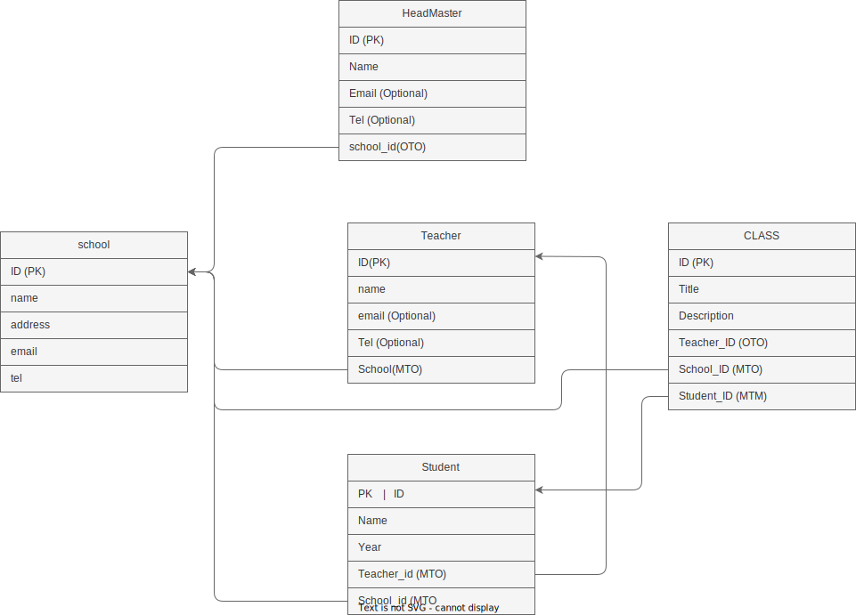

# Lexnetix School assignment
| Create a new Django project and app using Django Ninja Configure the Django app to use Django Ninja as the web framework  
## Model Diagarm  
  

Acronym:  
` OTO: one to one`  
` MTO: many to one`  
` MTM: many to many`   

## Creat Order 
**School**  
    ` Standalone Model` 
**HeadMater**  
    ` OTO -> School` 
**Teacher**  
    ` OTO -> School` 
**Student**  
    ` OTO -> School`
    ` OTM -> teacher`

**Class**
    `MTO -> Teacher`
    `MTO -> School`
    `MTM -> Student`