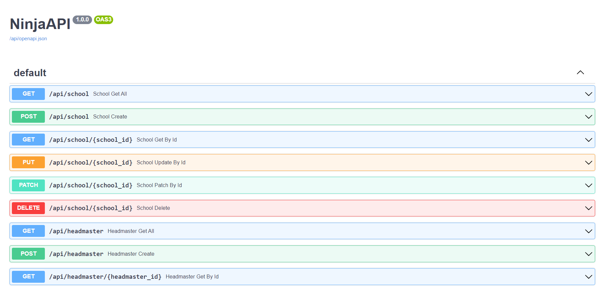

# Lexnetix School assignment
| Create a new Django project and app using Django Ninja Configure the Django app to use Django Ninja as the web framework  
## Model Diagarm  
  

Acronym:  
` OTO: one to one`  
` MTO: many to one`  
` MTM: many to many`   
 
## Creat Order   
**School**   
    ` Standalone Model`   
**HeadMater**   
    ` OTO -> School`   
**Teacher**   
    ` OTO -> School`  
**Student**  
    ` OTO -> School`  
    ` OTM -> teacher`  

**Class**  
    `MTO -> Teacher`  
    `MTO -> School`  
    `MTM -> Student`  

## Unit Test
```shell
python3 manage.py test
```

# Setup

---

run sever on localhost

### clone project to you PC

```python
git clone https://github.com/nwattana/Lexnetix-Assignment.git
```

### Runserver

```python
python3 ./LexneticSchool/manage.py runserver
```

# First Request

---

## CLI

upload data like JSON below

```
{
  "name": "school1",
  "email": "school1",
  "address": "see lom",
  "tel": "+12123"
}
```

### Sent Request

put below command on terminal

```bash
curl -X 'POST' \
  'http://127.0.0.1:8000/api/school' \
  -H 'accept: application/json' \
  -H 'Content-Type: application/json' \
  -d '{
  "name": "school1",
  "email": "school1",
  "address": "see lom",
  "tel": "+12123"
}'
```

### Result

```bash
{
  "id": 1,
  "name": "shool 1",
  "address": "schoo 1",
  "email": "schoo 1",
  "tel": "schoo1",
  "headmaster_name": null
}
```

## Check Django-Ninja documentation

go to webrower and put

```
http://127.0.0.1:8000/api/doc
```

 You will see the automatic, interactive API documentation (provided by the [OpenAPI / Swagger UI](https://github.com/swagger-api/swagger-ui))



# Model - http method

run in localhost

## School

The standalone model

Accept method

- GET
    
    `http://127.0.0.1:8000/api/school`
    
    - Retrive all Object
    
    `http://127.0.0.1:8000/api/school/{id}`
    
    - Retrive an object with specific ID
    
    ### Example Result
    
    ```json
    {
      "id": 0,
      "name": "string",
      "address": "string",
      "email": "string",
      "tel": "string",
      "headmaster_name": "string"
    }
    ```
    
- POST
    
    `http://127.0.0.1:8000/api/school`
    
    - Create an object with specific ID
    
    ### Example Result
    
    ```json
    {
      "id": 0,
      "name": "string",
      "address": "string",
      "email": "string",
      "tel": "string",
      "headmaster_name": "string"
    }
    ```
    
- PUT
    
    `http://127.0.0.1:8000/api/school/{id}`
    
    - Update an object with specific ID
    
    ### Example Result
    
    ```json
    {
      "id": 0,
      "name": "string",
      "address": "string",
      "email": "string",
      "tel": "string",
      "headmaster_name": "string"
    }
    ```
    
- PATCH
    
    `http://127.0.0.1:8000/api/school/{id}`
    
    - Update an object with specific ID
    
    ### Example Result
    
    ```json
    {
      "id": 0,
      "name": "string",
      "address": "string",
      "email": "string",
      "tel": "string",
      "headmaster_name": "string"
    }
    ```
    
- DELETE
    
    `http://127.0.0.1:8000/api/school/{id}`
    
    - Retrive a object with specific ID
    
    only return 204 on success
    

## Headmaster

Accept method

- GET
    
    `http://127.0.0.1:8000/api/headmaster`
    
    - for Retrive all Object
    
    Example Result
    
    ```json
    [
      {
        "id": 0,
        "name": "string",
        "email": "string",
        "tel": "string",
        "schoolname": "string"
      }
    ]
    ```
    
    `http://127.0.0.1:8000/api/teacher/{ID}`
    
    - for retrive a sigle object with specific ID
    
    Example Result
    
    ```json
    [
      {
        "id": 0,
        "name": "string",
        "email": "string",
        "tel": "string",
        "schoolname": "string"
      }
    ]
    ```
    
- POST
    
    `http://127.0.0.1:8000/api/headmaster`
    
    - for Create an object
    
    Example Result
    
    ```json
    {
      "id": 0,
      "name": "string",
      "email": "string",
      "tel": "string",
      "schoolname": "string"
    }
    ```
    
    `http://127.0.0.1:8000/api/headmaster/{id}`
    
    - for Retrive a single Object specific with id
    
    Example Result
    
    ```json
    {
      "id": 0,
      "name": "string",
      "email": "string",
      "tel": "string",
      "schoolname": "string"
    }
    ```
    
- PUT
    
    `http://127.0.0.1:8000/api/headmaster/{id}`
    
    - for Create an object
    
    Example Result
    
    ```json
    {
      "id": 0,
      "name": "string",
      "email": "string",
      "tel": "string",
      "schoolname": "string"
    }
    ```
    
- PATCH
    
    `http://127.0.0.1:8000/api/headmaster/{id}`
    
    - Update a single object with specific ID
    
    Example Result
    
    ```json
    {
      "id": 0,
      "name": "string",
      "email": "string",
      "tel": "string",
      "schoolname": "string"
    }
    ```
    
- DELETE
    
    `http://127.0.0.1:8000/api/headmaster/{id}`
    
    - Delete a single object with specific ID

## Teacher

Accept method

- GET
    
    `http://127.0.0.1:8000/api/teacher` 
    
    - for all objects
    
    Example Result
    
    ```json
    [
      {
        "id": 0,
        "name": "string",
        "email": "string",
        "tel": "string",
        "schoolname": "string"
      }
    ]
    ```
    
    `http://127.0.0.1:8000/api/teacher/{ID}`
    
    - for retrive a sigle object with specific ID
    
    Example Result
    
    ```json
      {
        "id": 0,
        "name": "string",
        "email": "string",
        "tel": "string",
        "schoolname": "string"
      }
    ```
    
- POST
    
    `http://127.0.0.1:8000/api/teacher/`
    
    - for create sigle object with specific ID
    
    Example Result
    
    ```json
    {
      "id": 0,
      "name": "string",
      "email": "string",
      "tel": "string",
      "schoolname": "string"
    }
    ```
    
- PUT
    
    `http://127.0.0.1:8000/api/teacher/{ID}`
    
    - for update a sigle object with specific ID
    
    Example Result
    
    ```json
    {
      "id": 0,
      "name": "string",
      "email": "string",
      "tel": "string",
      "schoolname": "string"
    }
    ```
    
- PATCH
    
    `http://127.0.0.1:8000/api/teacher/{id}`
    
    - Update a single object with specific ID
    
    Example Result
    
    ```json
    {
      "id": 0,
      "name": "string",
      "email": "string",
      "tel": "string",
      "schoolname": "string"
    }
    ```
    
- DELETE
    
    `http://127.0.0.1:8000/api/teacher/{id}`
    
    - Delete a single object with specific ID

## Student

Accept method

- GET
    
    `http://127.0.0.1:8000/api/student`
    
    - for all objects
    
    ### Example Reusult
    
    ```json
    [
    {
      "id": 0,
      "name": "string",
      "year": "string",
      "school": "string",
      "teacher": "string",
      "tclasses_list": [
        {
          "title": "string",
          "descript": "string"
        }
      ]
    }
    ]
    ```
    
    `http://127.0.0.1:8000/api/student/{ID}`
    
    - for a sigle object with specific ID
    
    ### Example Reusult
    
    ```json
    {
      "id": 0,
      "name": "string",
      "year": "string",
      "school": "string",
      "teacher": "string",
      "tclasses_list": [
        {
          "title": "string",
          "descript": "string"
        }
      ]
    }
    ```
    

- POST
    
    `http://127.0.0.1:8000/api/student`
    
    - for a sigle object with specific ID
    
    ### Example Result
    
    ```json
    {
      "id": 0,
      "name": "string",
      "year": "string",
      "school": "string",
      "teacher": "string",
      "tclasses_list": [
        {
          "title": "string",
          "descript": "string"
        }
      ]
    ```
    
- PUT
    
    `http://127.0.0.1:8000/api/student/{ID}`
    
    - for all objects
    
    ### Example Result
    
    ```json
    {
      "id": 0,
      "name": "string",
      "year": "string",
      "school": "string",
      "teacher": "string",
      "tclasses_list": [
        {
          "title": "string",
          "descript": "string"
        }
      ]
    ```
    
- PATCH
    
    `http://127.0.0.1:8000/api/student/{ID}`
    
    - for a sigle object with specific ID
    
    ### Example Result
    
    ```json
    {
      "id": 0,
      "name": "string",
      "year": "string",
      "school": "string",
      "teacher": "string",
      "tclasses_list": [
        {
          "title": "string",
          "descript": "string"
        }
      ]
    ```
    
- DELETE
    
    `http://127.0.0.1:8000/api/student/{id}`
    
    - Delete a single object with specific ID

## Class

Accept method

- GET
    
    `http://127.0.0.1:8000/api/tclasses`
    
    - for all objects
    
    ### Example Result
    
    ```json
    [
      {
        "title": "string",
        "description": "string",
        "teacher": "string",
        "student": [
          {
            "name": "string",
            "year": "string"
          }
        ],
        "school": "string"
      }
    ]
    ```
    
    `http://127.0.0.1:8000/api/tclasses/{ID}`
    
    - for a sigle object with specific ID
    
    ### Example Result
    
    ```json
      {
        "title": "string",
        "description": "string",
        "teacher": "string",
        "student": [
          {
            "name": "string",
            "year": "string"
          }
        ],
        "school": "string"
      }
    ```
    
- **POST**
    
    `http://127.0.0.1:8000/api/tclasses`
    
    - for a sigle object with specific ID
    
    ### Example Result
    
    ```json
    [
      {
        "title": "string",
        "description": "string",
        "teacher": "string",
        "student": [
          {
            "name": "string",
            "year": "string"
          }
        ],
        "school": "string"
      }
    ]
    ```
    
- **PUT**
    
    `http://127.0.0.1:8000/api/tclasses/{ID}`
    
    - for all objects
    
    ### Example Result
    
    ```json
    [
      {
        "title": "string",
        "description": "string",
        "teacher": "string",
        "student": [
          {
            "name": "string",
            "year": "string"
          }
        ],
        "school": "string"
      }
    ]
    ```
    
- **PATCH**
    
    `http://127.0.0.1:8000/api/tclasses/{ID}`
    
    - for a sigle object with specific ID
    - 404 on Class ID in valid
    
    ### Example Result
    
    ```json
    [
      {
        "title": "string",
        "description": "string",
        "teacher": "string",
        "student": [
          {
            "name": "string",
            "year": "string"
          }
        ],
        "school": "string"
      }
    ]
    ```
    
- DELETE
    
    `http://127.0.0.1:8000/api/tclasses/{id}`
    
    - Delete a single object with specific ID
    - 204 on success
    - 404 on Class ID in valid